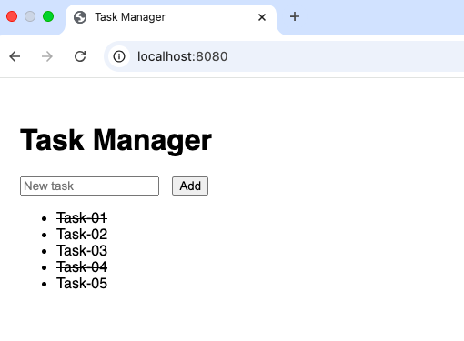
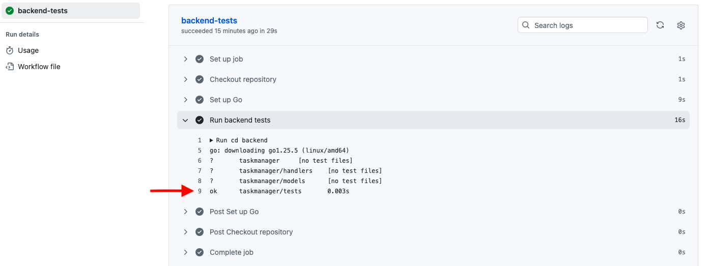

# Task Manager

The main goal of this project is to showcase the use of CI/CD with unit tests using GitHub Actions.
It is intentionally kept simple and is not meant to be a full-featured production application.

The project implements a small task manager with a Go backend and a basic HTML frontend to demonstrate the CI/CD setup in a practical way.

## Purpose

- Demonstrate CI/CD pipelines with automated unit tests.
- Show continuous integration using GitHub Actions.
- Provide a minimal backend API and a simple frontend interface.
- Illustrate a clean and easy-to-test project setup.

## How to Run

### Backend (Go)
1. Navigate to the `backend/` directory.
2. Run in bash: `go run main.go`

example:
```bash
cd backend
go run main.go
```
you should see the server starting on port 8080.
leave this terminal open to keep the server running.

### Frontend (HTML)
The frontend is a minimal HTML and JavaScript interface.
Its purpose is to provide a simple way to interact with the backend API and demonstrate its behavior.

It is intentionally kept simple and does not contain business logic, as the focus of the project is on the backend, testing, and CI setup.

The frontend is served directly from the Go backend.

Open your browser at:
http://localhost:8080



### Tests
- To run unit tests: Go to `backend/` and run `go test`.
explample:

```bash     
cd backend
go test ./...   
```
or if you want more detailed output:

```bash
go test -v ./...
```
you should see output indicating the tests have passed with ok or PASS status.

## CI/CD
- A GitHub Actions workflow is defined in `.github/workflows/ci.yml`.
- The workflow runs automatically on every push and pull request to the main branch.
- It sets up Go and executes all backend unit tests to ensure code quality.

